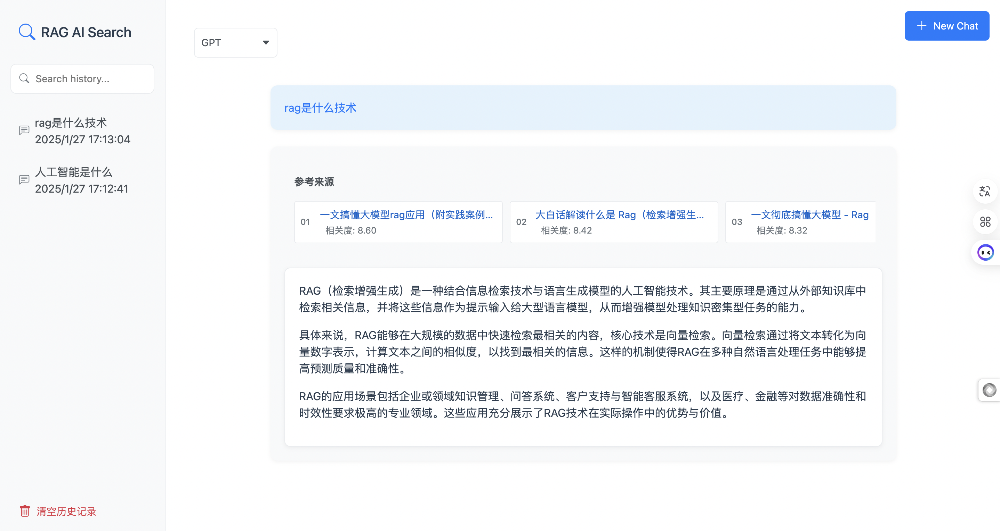

# RAG AI Search

一个基于 RAG (Retrieval-Augmented Generation) 的智能搜索系统，支持多种 LLM 模型，包括 GPT 和 Ollama 本地模型。



## 功能特点

- 支持多种 LLM 模型切换（GPT 和 Ollama 本地模型）
- 流式输出生成结果
- 显示参考文档来源
- 历史记录保存和查询
- 响应式界面设计

## 系统要求

- Python 3.8+
- Flask
- Azure OpenAI API 访问权限（用于 GPT）
- Ollama 服务（用于本地模型）

# 安装步骤

1. 克隆项目
```bash
git clone https://github.com/your-repo/rag-ai-search.git
```

2. 安装依赖

```bash
pip install -r requirements.txt
```

3. 安装ollama

- 安装ollama

  参考：[ollama安装](documents/Install_ollama.md)

- 安装后安装ollama模型

  ```bash
  ollama run llama3:8b
  ```

- 配置ollama服务地址

  config/settings.py中配置ollama服务地址

  ```bash
  OllamaConfig.BASE_URL = "http://127.0.0.1:4008"
  ```

4. 安装搜索引擎

- 安装搜索引擎

  参考：[安装搜索引擎](documents/Install_search_engine.md)

- 配置搜索引擎

    config/settings.py中配置搜索引擎

  ```bash
  SearchConfig.SEARX_BASE_URL = "http://127.0.0.1:11434"
  ```

5. 配置Azure OpenAI API

    在项目的根目录下新建.env文件，并配置以下环境变量：

```bash
gpt4o_mini_api_key='your_api_key'
gpt4o_mini_api_version='your_api_version'
gpt4o_mini_azure_endpoint='your_azure_endpoint'
```

    gpt调用方式：utils/gpt4_client.py

    ps: 如果没有gpt key, 直接使用ollama模型，不用配置Azure OpenAI

## 启动搜索系统

1. 启动Web服务

```python
python web/app.py
```

2. 打开浏览器访问: http://localhost:5000

3. 选择模型：
   - GPT：使用 Azure OpenAI 服务
   - Ollama 模型：使用本地部署的模型

4. 输入问题并等待回答
   - 系统会显示参考文档来源
   - 实时流式显示生成结果
   - 支持查看历史记录

# 技术架构


